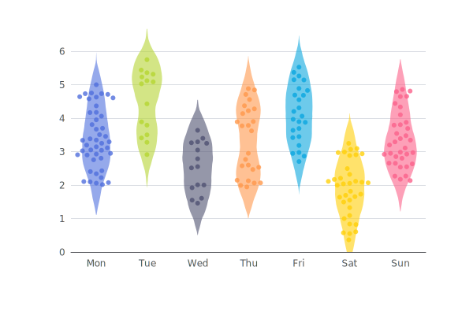
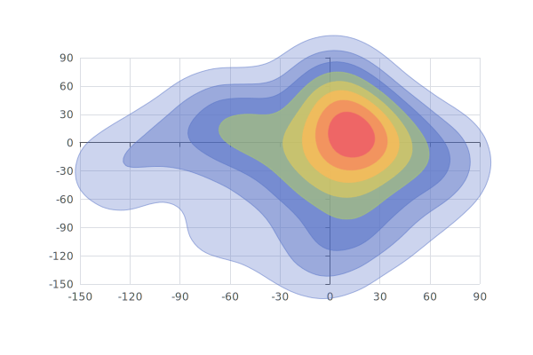
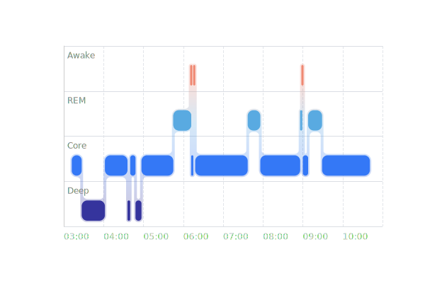
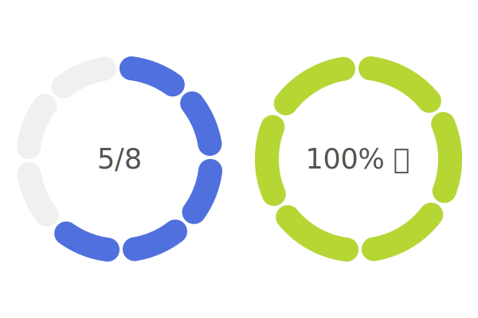
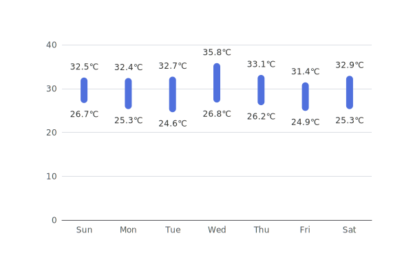
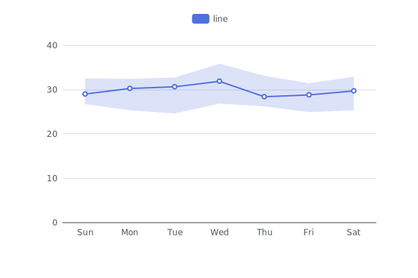

# echarts-custom-series

This repo provides some custom series for [Apache ECharts](https://github.com/apache/echarts). The minial supported version is Apache ECharts v6, which is not released yet.

## List of Custom Series

| | |
|-|-|
| `@echarts-x/custom-violin`<br> [doc](custom-series/violin) [npm](https://www.npmjs.com/package/@echarts-x/custom-violin) <br>  | `@echarts-x/custom-contour`<br> [doc](custom-series/contour) [npm](https://www.npmjs.com/package/@echarts-x/custom-contour) <br>  |
| `@echarts-x/custom-stage`<br> [doc](custom-series/stage) [npm](https://www.npmjs.com/package/@echarts-x/custom-stage) <br>  | `@echarts-x/custom-segmented-doughnut`<br> [doc](custom-series/segmentedDoughnut) [npm](https://www.npmjs.com/package/@echarts-x/custom-segmented-doughnut) <br>  |
| `@echarts-x/custom-bar-range`<br> [doc](custom-series/barRange) [npm](https://www.npmjs.com/package/@echarts-x/custom-bar-range) <br>  | `@echarts-x/custom-line-range`<br> [doc](custom-series/lineRange) [npm](https://www.npmjs.com/package/@echarts-x/custom-line-range) <br>  |
| `@echarts-x/custom-liquid-fill`<br> [doc](custom-series/liquidFill) [npm](https://www.npmjs.com/package/@echarts-x/custom-liquid-fill) <br>  | |

See the README in the above links about how to install and use.

## Develop

```bash
npm install
```

### Create A New Custom Series

```bash
npm run generate <series-name>
```

The generated files are in `custom-series/<series-name>`. Note that if there are multiple words in the series name, they should be in camel case like `npm run generate barRange`.

### Build

Each of the directories in `custom-series/` is a custom series.

#### Build All

```bash
npm run build
```

#### Build One

```bash
npm run build <series-name>
```

For example, to build `custom-series/violin`, run:

```bash
npm run build violin
```

### Generate Thumbnails

```bash
npm run thumbnail
# or
npm run thumbnail <series-name>
```

### Publish on npm

#### Beta Release

```bash
npm run build [customSeriesName]

# cd to the directory of a custom series
# change the version in package.json with -beta.0
npm install # to update the version in package-lock.json
npm login
npm version prerelease --preid=beta
npm publish --tag beta --dry-run
# if the output is ok
npm publish --tag beta
```

#### Latest Release

```bash
npm run build [customSeriesName]

# cd to the directory of a custom series
# change the version in package.json
npm install # to update the version in package-lock.json
npm login
npm publish --dry-run
# if the outpuf is ok
npm publish
```
