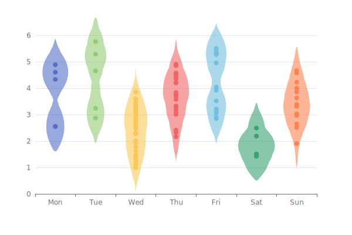
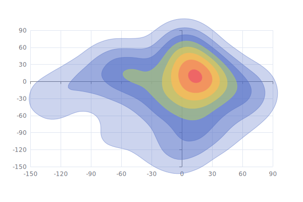
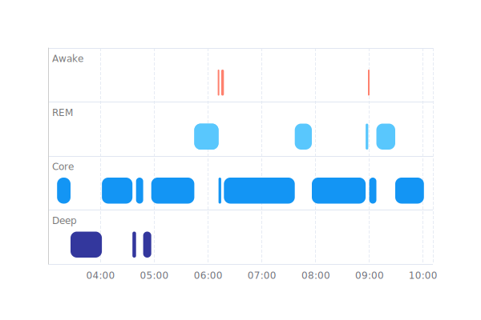
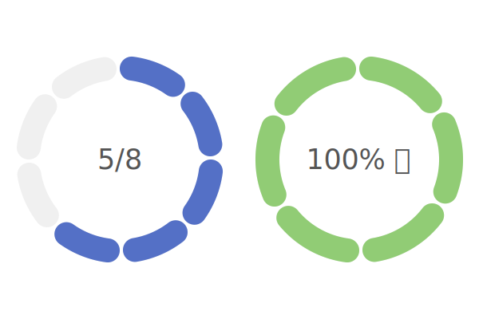
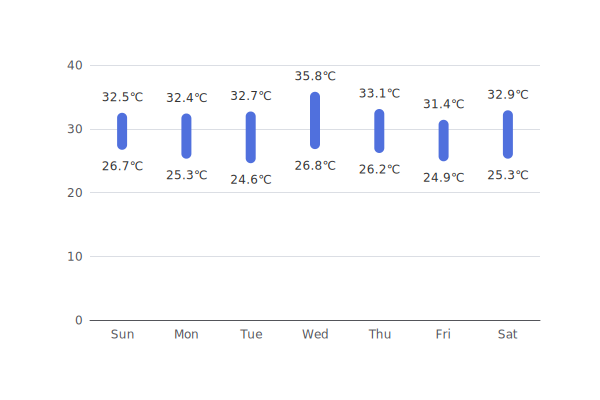

# echarts-custom-series

This repo provides some custom series for [Apache ECharts](https://github.com/apache/echarts). The minial supported version is Apache ECharts v6, which is not released yet.

## List of Custom Series

| | |
|-|-|
| [violin](custom-series/violin) <br>  | [contour](custom-series/contour) <br>  |
| [stage](custom-series/stage) <br>  | [segmentedDoughnut](custom-series/segmentedDoughnut) <br>  |
| [barRange](custom-series/barRange) <br>  | [lineRange](custom-series/lineRange) <br>  |

## Setup

```bash
npm install
```

Note: Building requires the lib files of ECharts v6. So before ECharts v6 is released, you need to clone `apache/echarts` locally and use `npm link` to link it.

```bash
# Under the directory of zrender
git checkout v6
npm install
npm run prepare
npm link

# Under the directory of echarts
git checkout v6
npm install
npm link zrender
npm link
npm run prepare
npm run build

# Under the directory of echarts-custom-series/custom-series/<series-name>
npm link echarts
```

## Create A New Custom Series

```bash
npm run generate <series-name>
```

The generated files are in `custom-series/<series-name>`. Note that if there are multiple words in the series name, they should be in camel case like `npm run generate barRange`.

## Build

Each of the directories in `custom-series/` is a custom series.

### Build All

```bash
npm run build
```

### Build One

```bash
npm run build <series-name>
```

For example, to build `custom-series/violin`, run:

```bash
npm run build violin
```

## Generate Thumbnails

```bash
npm run thumbnail
# or
npm run thumbnail <series-name>
```

## Publish to the npm registry

TODO
